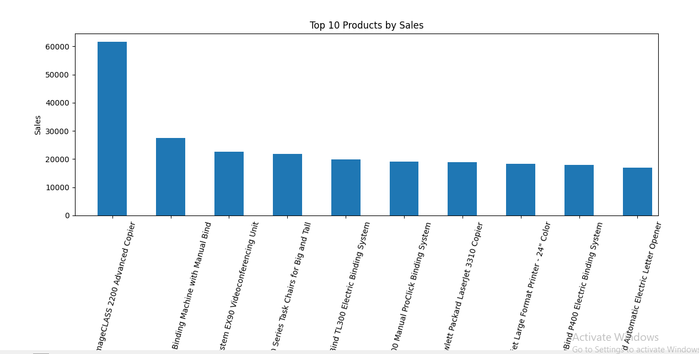
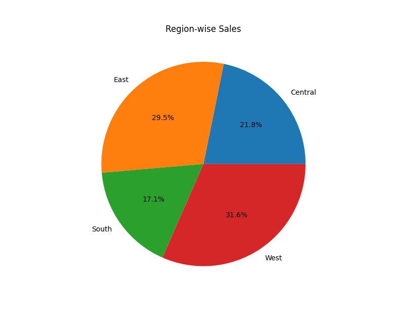
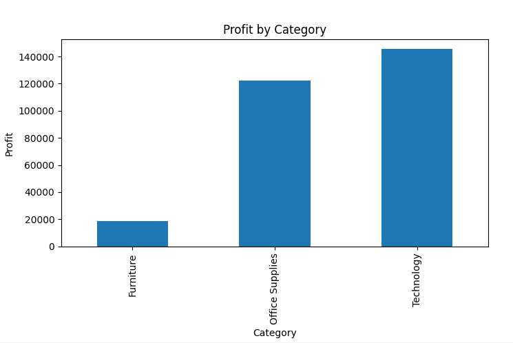
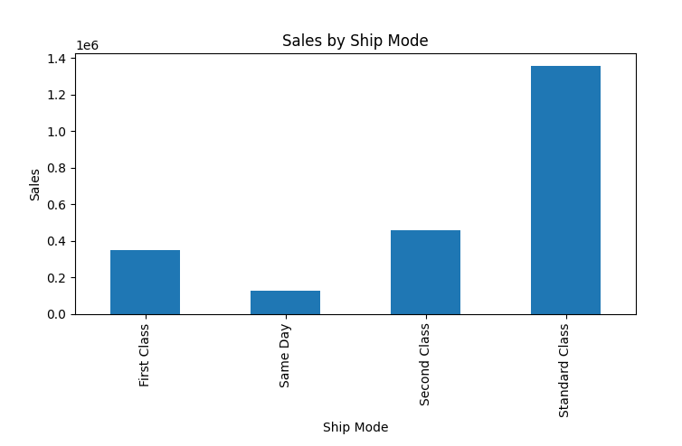

# Sales Analytics Dashboard

This project analyzes retail sales data using Python and visualizes important business insights.

## Features
- Sales Analysis
- Profit Analysis
- Region-wise Sales Insights
- Top Selling Products Analysis
- Data Visualization using Charts

## Technologies Used
- Python
- Pandas
- Matplotlib

## Dataset
Sample Superstore Sales Dataset

## Project Output

### Top 10 Products by Sales


### Region-wise Sales


### Profit by Category


### Sales by Ship Mode


## How to Run

### 1. Install required libraries
```bash
pip install pandas matplotlib
```

### 2. Run the project
```bash
py analysis.py
```

## Author
Radha Yadav
